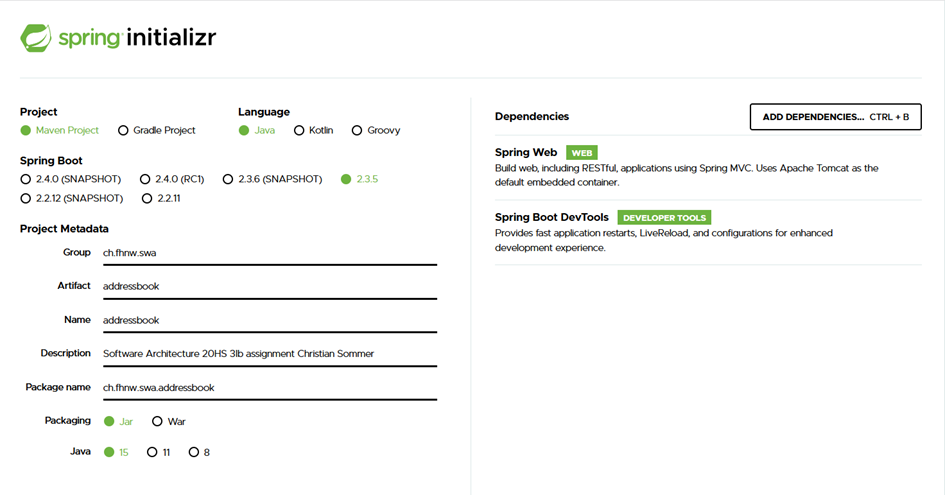

# SWA Module, Graded Exercise

## Project

* Matriculation Number: 16-665-176
* Evento-ID:	10003529
* E-Mail: christian.sommer@students.fhnw.ch

You might choose between following **Java** applications:
* Contact list
* Library

The delivered application should be composed of multiple **modules** resp. should generate multiple **jars**.

The **frontend** (or **view** - probably in its own **module**/**component**) might be a **REST** API or **Server Pages** based. If you implement a **REST** API, then you will have to provide me a client (i.e., **React**) or you will have to tell how I can realise the minimum requirements (see below).

To start the application, you might use one of the following mechanisms:
* Using **Java** [modules](https://github.com/ribeaud/ch.fhnw.swa.modserv.cli/blob/master/Commands.txt).
* [Repacking](https://ribeaud.github.io/SWA/lectures/5/#10) a multi-**modules** **Spring Boot** application into a single **jar**.
* Using `-classpath` **Java** option.

#### Minimum requirements

The application should be able to, at least, do the following:
* List the entities
* Create/edit one entity

You will have to use a repository (or database), where you will _persist_ the entities. This repository could be a _real_ database (deployed via **Docker** for instance), an _in-memory_ one or a simple file.

#### Suggested course of action

1. Think about the components you will need
1. Draw a component/class diagram
1. Start to code

#### Possible extensions

* Delete
* Entity:
  * `Magazine` (as extension of `Book`)
  * `Company` (as extension of `Person`)
* Image upload (in its own *module*)

#### Reference applications

* [ch.fhnw.swa.modserv.cli](https://github.com/ribeaud/ch.fhnw.swa.modserv.cli)
* [myshop](https://github.com/ribeaud/blog-code-samples/tree/master/myshop)
* [PetClinic](https://github.com/spring-projects/spring-petclinic)

## Project delivery

### License
    Copyright 2020 Christian Sommer <christian.sommer@students.fhnw.ch>

    Licensed under the Apache License, Version 2.0 (the "License");
    you may not use this file except in compliance with the License.
    You may obtain a copy of the License at

       http://www.apache.org/licenses/LICENSE-2.0

    Unless required by applicable law or agreed to in writing, software
    distributed under the License is distributed on an "AS IS" BASIS,
    WITHOUT WARRANTIES OR CONDITIONS OF ANY KIND, either express or implied.
    See the License for the specific language governing permissions and
    limitations under the License.

### Requirements
* JDK 14
* Node.Js >15
* IntelliJ IDE (recommended)

### How to start the project:
The application is divided into frontend and backend. The frontend is mostly implemented with React while the backend is 
run with SpringBoot and Hibernate as a REST API.To store data i decided to use a h2 database.

To start the backend, all maven dependencies must be resolved. InelliJ usually does this itself. To start it run the
AddressbookApplication.java class in the package ch.fhnw.swa.addressbook.Another possibility is to start the server from 
the menu bar.

The REST API can reached with curl.
example:
`http://localhost:8080/entries` and `http://localhost:8080/entries/1`

The following HTTP methods are available on the server side:

* [GET]  `/entries` - returns all entries in the address book.
* [GET]  `/entries/{id}` - returns a entra by ID.
* [DELETE] `/entries/{id}` - deletes an entry by ID.
* [PUT] `/entries/{id}` - updates an entry by ID.
* [POST] `/upload/{id}`- post a avatar for the entry by ID.

so possible actions are, create an entry, edit an entry, delete entry, add an avatar to an entry, edit avatar on the entry
over curl or the frontend-app UI. 

To start the `frontend-app`, all dependencies must be resolved. InelliJ usually does this itself.If not, change to the 
frontend-app directory and run the command  `npm install`.  To start te frontend `npm start` must be executed

`C:\Users\aso\Documents\GitHub\swa-en\frontend-app> npm start`

the frontend can be reached via the url `http://localhost:3000/`. Navigation in the frontend should be self-explanatory.

#### Database location
Set the path for the database at `spring.datasource.url=jdbc:h2:file:C:/temp` at the project `application.properties`.
It is in `src/main/resources`. For the test database the same must be configured. The test `application.properties` file
is located in `/src/test/resources`.

For Linux or UNIX systems the path would have to be different. For example:
spring.datasource.url=jdbc:h2:file:`~/home/public/prod` and `~/home/public/test` in the test directory

The PROD database is accessible as long as the server is running at `http://localhost:8080/h2`.
User is `sa` and no password. Path to the database is the previously set path.

#### Test the project
All test tests are stored in the test directory `src/test/java`. These can be started individually or all together.
With a right mouse click on the 'green' test folder all tests can be started with the menu item 'Run all tests'.

#### External contributions: 
<i>none</i>

#### Other comments:
1) I built the basic Project basic structure  with https://start.spring.io/

2) I generated the basic structure of the frontend app with npx. `npx create-react-app frontend-app`

3) UML diagrams and description can be found in the pdf `UML diagrams and description for SWA assignment 20HS 3Ib from 
   Christian Sommer.pdf` in the main project folder.

#### proud of
I'm particular proud of: <i>that images can be uploaded and are validated by size and type</i>

## Project grading

(_to be filled by lecturer_)
